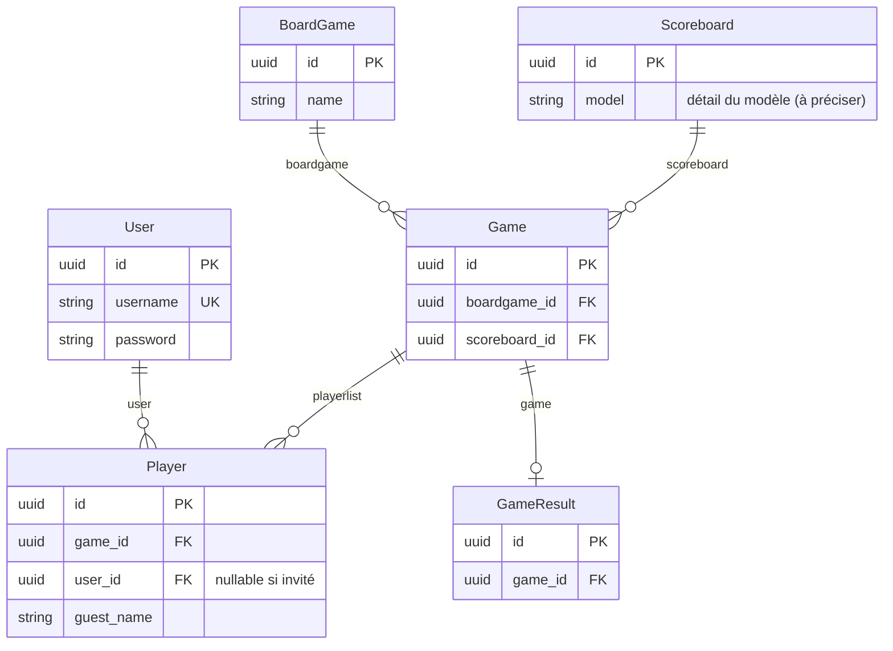

## Entités

### User

Utilisateur de l’application.

| Attribut       | Description                                      |
|----------------|--------------------------------------------------|
| `id`           | Identifiant unique (PK)                          |
| `username`     | Nom d’utilisateur (unique)                       |
| `password`     | Mot de passe (stockage sécurisé à définir côté application)        |

---

### BoardGame

Jeu de société référencé dans le catalogue.

| Attribut | Description        |
|----------|--------------------|
| `id`     | Identifiant (PK)   |
| `name`   | Nom du jeu         |

---

### Scoreboard

Modèle de feuille de score (template) — configuration / structure pour noter une partie.

| Attribut | Description                          |
|----------|--------------------------------------|
| `id`     | Identifiant (PK)                     |
| *(à préciser)* | Détail du modèle (colonnes, règles, etc.) |

---

### Game

Une **partie** (session de jeu) en cours ou terminée.

| Attribut    | Description                                                                 |
|-------------|-----------------------------------------------------------------------------|
| `id`         | Identifiant (PK)                                                            |
| `boardgame`  | Jeu associé                                                                 |
| `playerlist` | Joueurs de la partie, modélisés par l’entité **Player** (ci‑dessous)      |
| `scoreboard` | Modèle de feuille de score utilisé                                          |

---

### Player

Participation d’un joueur à une partie.

| Attribut     | Description                                                |
|--------------|------------------------------------------------------------|
| `id`         | Identifiant (PK)                                           |
| `game`       | Partie concernée (FK)                                      |
| `user`       | Compte applicatif (FK), **nullable** si joueur invité     |
| `guest_name` | Nom affiché pour un invité sans compte (si `user` absent) |

---

### GameResult

Résultat final d’une partie (scores, classement, etc.).

| Attribut | Description                    |
|----------|--------------------------------|
| `id`     | Identifiant (PK), si besoin    |
| `game`   | Partie concernée |

---

## Diagramme ERD

