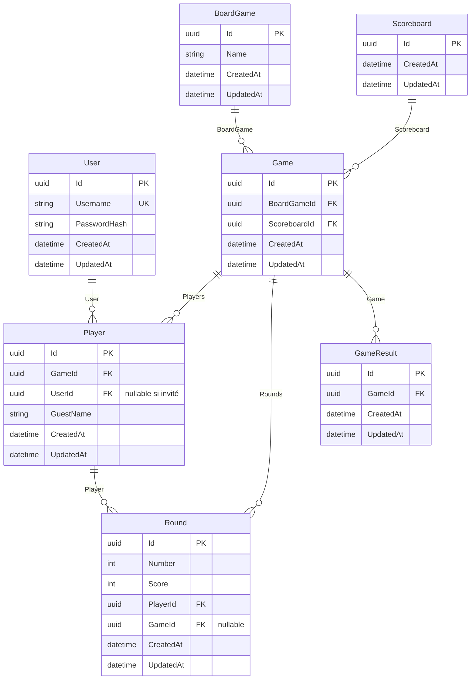

## Entités

Toutes les entités concrètes héritent de **`BaseEntity`** : `Id` (Guid, PK), `CreatedAt` (DateTime UTC), `UpdatedAt` (nullable).

---

### User

Utilisateur de l’application. Table : `users`.

| Attribut        | Description                                                                 |
|-----------------|----------------------------------------------------------------------------|
| `Id`            | Identifiant unique (PK)                                                    |
| `Username`      | Nom d’utilisateur (unique, max 50 caractères)                              |
| `PasswordHash`  | Hachage de mot de passe ASP.NET Core Identity (`IPasswordHasher<User>`), max 256 caractères |

---

### BoardGame

Jeu de société référencé dans le catalogue. Table : `boardgames`.

| Attribut | Description              |
|----------|--------------------------|
| `Id`     | Identifiant (PK)         |
| `Name`   | Nom du jeu (max 100)     |

---

### Scoreboard

Modèle de feuille de score (template). Table : `scoreboards`.

| Attribut | Description                                      |
|----------|--------------------------------------------------|
| `Id`     | Identifiant (PK)                                 |
| *(aucun champ métier pour l’instant)* | Colonnes / structure à définir dans le modèle |

---

### Game

Une **partie** (session de jeu). Table : `games`.

| Attribut / navigation | Description                                                                 |
|----------------------|----------------------------------------------------------------------------|
| `Id`                 | Identifiant (PK)                                                            |
| `BoardGameId`        | FK vers le jeu de société                                                   |
| `ScoreboardId`       | FK vers le modèle de feuille de score                                       |
| `BoardGame`          | Jeu associé                                                                 |
| `Scoreboard`         | Modèle de feuille de score utilisé                                          |
| `Players`            | Joueurs de la partie (**Player**)                                           |
| `Rounds`             | Manches / scores par tour (**Round**)                                       |

---

### Player

Participation d’un joueur à une partie. Table : `players`.

| Attribut     | Description                                                |
|--------------|------------------------------------------------------------|
| `Id`         | Identifiant (PK)                                           |
| `GameId`     | Partie concernée (FK)                                      |
| `UserId`     | Compte applicatif (FK), **nullable** si joueur invité      |
| `User`       | Compte lié (nullable)                                      |
| `Game`       | Partie (navigation requise)                                |
| `GuestName`  | Nom affiché pour un invité sans compte (max 50, nullable)   |

---

### Round

Une **manche** (ou entrée de score) pour un joueur dans une partie. Table : `rounds`. Classe C# : `Round` (fichier `Rounds.cs`).

| Attribut / navigation | Description                                                                 |
|----------------------|----------------------------------------------------------------------------|
| `Id`                 | Identifiant (PK)                                                            |
| `Number`             | Numéro de manche (entier)                                                   |
| `Score`              | Score pour cette manche                                                     |
| `Player`             | Joueur concerné (FK `PlayerId`)                                             |
| `GameId`             | FK optionnelle vers la partie (relation `Game.Rounds` / EF Core)            |

---

### GameResult

Résultat final d’une partie (placeholder métier pour l’instant). Table : `game_results`.

| Attribut | Description                    |
|----------|--------------------------------|
| `Id`     | Identifiant (PK)               |
| `GameId` | Partie concernée (FK)          |
| `Game`   | Partie (navigation requise)    |

---

## Diagramme ERD

