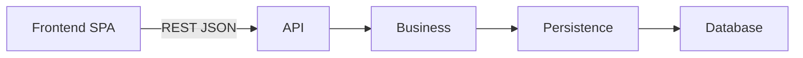

# Architecture

## Objectif

Ce document decrit l'architecture cible de Scorpanion au niveau de la conception.

Il formalise :
- la vue d'ensemble du systeme
- les grandes responsabilites techniques
- les couches du backend
- les flux majeurs de la V1
- les limites volontaires du projet a ce stade

Ce document reste agnostique de la stack technique.

## Principes directeurs

- Scorpanion est concu comme une `SPA` connectee a une `API` backend en `REST JSON`.
- Le frontend calcule la premiere proposition de resultat d'une partie.
- La source de verite absolue est la validation finale par l'utilisateur avant l'enregistrement.
- Le backend reste simple en V1 mais conserve les invariants metier minimum.
- Les donnees persistees sont immuables apres creation en V1.
- La V1 couvre avant tout la creation et la persistance des donnees metier.
- L'historique detaille et le module `Stats` sont hors perimetre pour l'instant.

## Vue d'ensemble

## Composants principaux

### Frontend SPA

Le frontend porte l'experience utilisateur et la preparation du resultat avant persistance.

Responsabilites :
- permettre la creation de `Game`
- permettre la creation de `Player`
- permettre la saisie d'une `GameSession`
- saisir les scores quand le `Game` est base sur un score
- calculer une premiere proposition de classement et de vainqueur
- afficher un recapitulatif editable
- laisser l'utilisateur ajuster librement le classement et le ou les vainqueurs
- demander une confirmation finale avant enregistrement
- envoyer a l'API le resultat final valide

### API

La couche `API` expose les capacites du backend a la SPA.

Responsabilites :
- exposer des endpoints `REST JSON`
- recevoir les requetes du frontend
- valider la structure et le format des payloads
- transformer les requetes en appels a la couche `Business`
- transformer les resultats de `Business` en reponses API

### Business

La couche `Business` porte une logique metier legere en V1.

Responsabilites :
- orchestrer les cas d'usage du backend
- verifier que le `Game` reference existe
- verifier que les `Player` references existent
- verifier qu'un meme `Player` n'apparait pas plusieurs fois dans la meme `GameSession`
- garantir l'immuabilite des donnees en V1 en ne prevoyant que des usages de creation
- declencher l'enregistrement d'une partie complete dans une transaction unique

### Persistence

La couche `Persistence` gere l'acces a la base de donnees.

Responsabilites :
- lire les donnees persistees
- ecrire les donnees persistees
- persister `Game`
- persister `Player`
- persister `GameSession`
- persister `SessionPlayerResult`
- executer les transactions necessaires

Cette couche ne porte pas de decision metier.

## Flux majeurs de la V1

### Creer un Game

1. Le frontend soumet une demande de creation de `Game`.
2. L'API valide le format de la requete.
3. La couche `Business` orchestre le cas d'usage.
4. La couche `Persistence` enregistre le `Game`.

### Creer un Player

1. Le frontend soumet une demande de creation de `Player`.
2. L'API valide le format de la requete.
3. La couche `Business` orchestre le cas d'usage.
4. La couche `Persistence` enregistre le `Player`.

### Creer une GameSession

1. Le frontend selectionne ou cree le `Game`.
2. Le frontend selectionne ou cree les `Player`.
3. Le frontend saisit les scores si le `Game` est base sur un score.
4. Le frontend calcule une premiere proposition de resultat.
5. Le frontend affiche un recapitulatif editable.
6. L'utilisateur ajuste librement le classement et le ou les vainqueurs si necessaire.
7. L'utilisateur confirme le resultat final.
8. Le frontend envoie a l'API la `GameSession` finale avec ses `SessionPlayerResult`.
9. L'API valide la structure de la requete.
10. La couche `Business` verifie les invariants metier minimum.
11. La couche `Persistence` enregistre `GameSession` et `SessionPlayerResult` dans une transaction unique.

## Repartition des responsabilites metier

### Ce que le frontend fait

- calculer la premiere proposition de resultat
- afficher la logique de recapitulatif
- permettre l'ajustement manuel du resultat final
- presenter la confirmation finale

### Ce que le backend garantit

- l'existence des references `Game` et `Player`
- l'absence de doublon de `Player` dans une meme `GameSession`
- l'enregistrement atomique d'une partie complete
- l'immuabilite des donnees de la V1

### Ce que le backend ne fait pas pour l'instant

- recalculer le resultat final a la place du frontend
- imposer une coherence forte entre score, classement et vainqueur
- gerer l'historique detaille
- gerer les statistiques
- gerer les modifications ou suppressions

## Lien avec le modele de donnees

L'architecture s'appuie directement sur les entites decrites dans [database.md](/C:/Users/Arnaud/Documents/Perso/Projects/Workspace/scorpanion/project-management/conception/database.md:1) :
- `Game`
- `Player`
- `GameSession`
- `SessionPlayerResult`

Le point central est le suivant :
- `SessionPlayerResult` porte le resultat final valide par l'utilisateur
- la proposition initiale du frontend n'est pas la source de verite

## Limites volontaires de la V1

- pas de gestion de compte
- pas de modification des donnees apres creation
- pas de suppression
- pas de module `Stats`
- pas de consultation d'historique detaille definie a ce stade
- pas de choix de stack technique dans ce document

## Evolutions probables

- ajout d'un module `Stats`
- ajout d'un module d'historique plus riche
- ajout de validations metier plus strictes dans `Business`
- ajout de capacites d'administration
- ajout eventuel de fonctionnalites de correction ou de suppression
