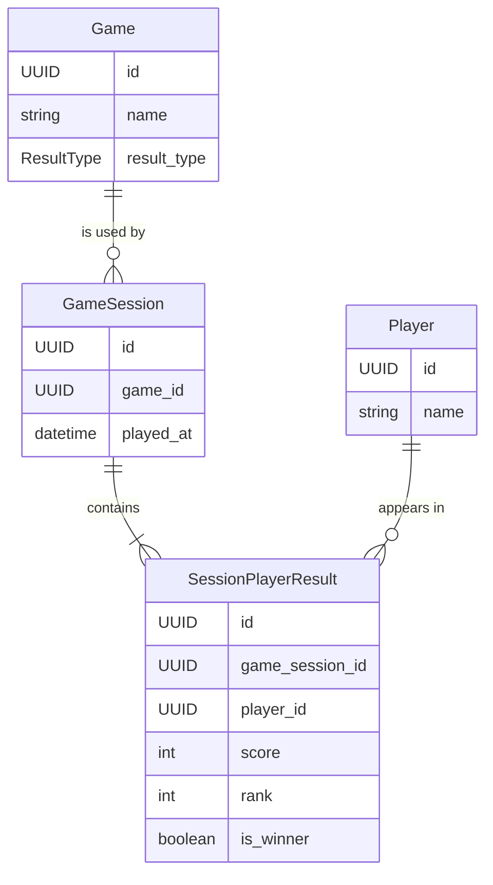

# Database

## Objectif

Ce document decrit le modele de donnees logique de Scorpanion.

Il formalise :
- les entites persistees
- leurs relations
- leurs champs principaux
- les contraintes metier importantes
- les regles de verite des donnees enregistrees

Ce document reste au niveau de la conception. Il ne decrit pas encore l'implementation SQL.

## Principes generaux

- Les entites sont nommees en anglais.
- Les identifiants sont des UUID.
- En V1, toutes les donnees persistees sont immuables apres creation.
- La source de verite absolue est la validation finale par l'utilisateur avant l'enregistrement d'une partie.
- Les calculs automatiques servent uniquement d'aide a la saisie.
- Les noms de `Game` et `Player` sont trimmes avant validation et persistance.
- Les noms de `Game` et `Player` sont uniques de facon insensible a la casse.
- Les espaces en debut et fin sont ignores pour l'unicite.
- Les accents et les autres differences de caracteres restent significatifs.

## Diagramme

## Entites

### Game

Represente un jeu pouvant etre utilise pour enregistrer une partie.

Champs :
- `id`
- `name`
- `result_type`

Regles :
- `name` est trimme avant validation et persistance.
- `name` est unique selon une comparaison insensible a la casse.
- Les espaces autour du nom sont ignores pour l'unicite.
- Un `Game` est immuable apres creation en V1.
- Un `Game` ne peut pas etre supprime en V1.

### Player

Represente une personne pouvant participer a une partie.

Champs :
- `id`
- `name`

Regles :
- `name` est trimme avant validation et persistance.
- `name` est unique selon une comparaison insensible a la casse.
- Les espaces autour du nom sont ignores pour l'unicite.
- Un `Player` est immuable apres creation en V1.
- Un `Player` ne peut pas etre supprime en V1.

### GameSession

Represente une partie jouee d'un jeu donne.

Champs :
- `id`
- `game_id`
- `played_at`

Regles :
- Une `GameSession` appartient a un seul `Game`.
- Une `GameSession` contient au moins un participant.
- Une `GameSession` ne peut pas etre modifiee en V1.
- Une `GameSession` ne peut pas etre supprimee en V1.
- Une confirmation finale est demandee avant l'enregistrement.

### SessionPlayerResult

Represente le resultat final valide d'un `Player` dans une `GameSession`.

Champs :
- `id`
- `game_session_id`
- `player_id`
- `score`
- `rank`
- `is_winner`

Regles :
- Cette entite relie un `Player` a une `GameSession`.
- Cette entite porte le resultat final valide par l'utilisateur.
- Un meme `Player` ne peut apparaitre qu'une seule fois dans une meme `GameSession`.
- `score` est optionnel.
- `rank` est optionnel.
- `is_winner` est obligatoire.

## Enumeration

### ResultType

Valeurs :
- `NO_SCORE`
- `HIGHEST_SCORE`
- `LOWEST_SCORE`

Signification :
- `NO_SCORE` : aucun score n'est saisi
- `HIGHEST_SCORE` : l'application propose un resultat initial base sur le score le plus eleve
- `LOWEST_SCORE` : l'application propose un resultat initial base sur le score le plus faible

## Relations

- Un `Game` peut etre utilise dans plusieurs `GameSession`.
- Une `GameSession` reference exactement un `Game`.
- Une `GameSession` contient un ou plusieurs `SessionPlayerResult`.
- Un `Player` peut apparaitre dans plusieurs `SessionPlayerResult`.
- Un `SessionPlayerResult` appartient a une seule `GameSession`.
- Un `SessionPlayerResult` appartient a un seul `Player`.

## Contraintes metier

### Contraintes sur les noms

- `Game.name` est unique de facon insensible a la casse.
- `Player.name` est unique de facon insensible a la casse.
- Les espaces en debut et fin sont ignores pour l'unicite.
- Les accents restent significatifs.

### Contraintes sur les parties

- `game_id` est obligatoire.
- `played_at` est obligatoire.
- Une `GameSession` doit contenir au moins un `SessionPlayerResult`.

### Contraintes sur les resultats

- `game_session_id` est obligatoire.
- `player_id` est obligatoire.
- `is_winner` est obligatoire.
- `score` et `rank` sont absents pour les jeux `NO_SCORE`.
- `score` est un entier et peut etre negatif.
- `rank` n'existe que pour les jeux a score.
- Le classement suit la convention `1, 1, 3` en cas d'ex aequo.

## Regles de verite metier

- Pour les jeux a score, l'application genere une proposition initiale de classement et de vainqueur.
- Cette proposition peut etre modifiee librement avant validation finale.
- Le resultat enregistre est toujours le resultat valide par l'utilisateur.
- Le score n'est pas la source de verite absolue sur l'issue d'une partie.
- Le classement n'est pas forcement deduit mecaniquement du score.
- Le ou les vainqueurs ne sont pas forcement determines uniquement par le score.

## Cas particuliers actes

- Une partie peut avoir un seul joueur.
- Une partie solo peut etre perdue.
- Une partie peut avoir zero, un ou plusieurs vainqueurs.
- Une partie `NO_SCORE` n'a ni score ni classement.
- Une partie `NO_SCORE` peut ne pas avoir de vainqueur.
- Lors de la saisie d'une partie, un `Game` ou un `Player` peut etre cree a la volee.
- Cette creation a la volee est prise en compte immediatement.

## Hors perimetre pour l'instant

Ce document ne couvre pas encore :
- les statistiques
- les champs d'audit
- les comptes utilisateurs
- l'administration
- les suppressions futures
- les details SQL
- les index techniques
